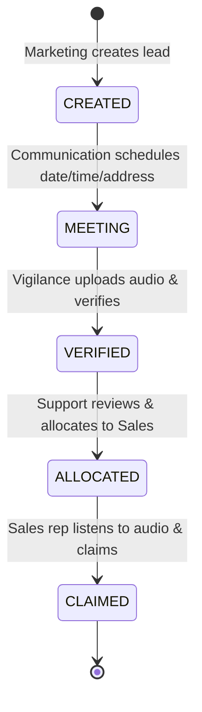

# Vibh-Anu CRM – Role-Based Lead Management System

A production-grade, state-machine driven **Lead Management System (CRM)** built with strict Role-Based Access Control (RBAC), end-to-end audit logging, and tamper-resistant audio verification for multi-department workflows.

---

## 📋 Table of Contents
- [1. Core Objective](#1-core-objective)
- [2. System Architecture](#2-system-architecture)
- [3. Workflow State Machine](#3-workflow-state-machine)
- [4. Role & Department Responsibilities](#4-role--department-responsibilities)
- [5. Role Permission Matrix](#5-role-permission-matrix)
- [6. Sales Audio Verification & Security Model](#6-sales-audio-verification--security-model)
- [7. Database Schema Design](#7-database-schema-design)
- [8. API Contract & Workflow Endpoints](#8-api-contract--workflow-endpoints)
- [9. Project Directory Structure](#9-project-directory-structure)
- [10. Implementation Roadmap](#10-implementation-roadmap)
- [11. Environment Variables](#11-environment-variables)

---

## 1. Core Objective

Ek lead/customer **Marketing** department dwara system mein create hota hai aur controlled workflow ke through 5 departments se sequential order mein process hota hai:

$$\text{Marketing} \longrightarrow \text{Communication} \longrightarrow \text{Vigilance} \longrightarrow \text{Support} \longrightarrow \text{Sales} \longrightarrow \text{Claimed}$$

### Guiding Principles:
1. **Strict State Machine**: Koi bhi department unauthorized ya out-of-order transition perform nahi kar sakta.
2. **Role-Based Isolation**: Har department user ko sirf unki state aur unke role ke mutabiq allowed leads aur fields dikhengi.
3. **Audit Trail**: Har state transition `workflow_logs` collection mein timestamp, user ID, role, aur metadata ke sath record hoti hai.
4. **Backend-Enforced Business Rules**: Sales rep bina complete call audio sune lead claim nahi kar sakta (frontend button disable + backend verification check).

---

## 2. System Architecture

```
                         ┌───────────────────────────────┐
                         │             USERS             │
                         │    5 Department Roles (RBAC)   │
                         └───────────────┬───────────────┘
                                         │
                                         ▼
                         ┌───────────────────────────────┐
                         │        React Frontend         │
                         │   React 18 + TypeScript + Vite│
                         │   Tailwind CSS / Glassmorphism│
                         └───────────────┬───────────────┘
                                         │
                                   HTTPS / REST
                                         │
                                         ▼
                         ┌───────────────────────────────┐
                         │       Node + Express API      │
                         │         (TypeScript)          │
                         │                               │
                         │  • Authentication (JWT/Cookie)│
                         │  • RBAC & State Middleware    │
                         │  • Lead & Workflow Service    │
                         │  • Audio & Cloudinary Service │
                         │  • Audit Logging Engine       │
                         └───────┬───────────────┬───────┘
                                 │               │
                     ┌───────────┘               └───────────┐
                     ▼                                       ▼
            ┌─────────────────┐                     ┌─────────────────┐
            │     MongoDB     │                     │   Cloudinary    │
            │  (Mongoose ORM) │                     │  (Cloud Storage)│
            │                 │                     │                 │
            │ • users         │                     │ • Customer call │
            │ • leads         │                     │   audio files   │
            │ • workflow_logs │                     │                 │
            └─────────────────┘                     └─────────────────┘
```

---

## 3. Workflow State Machine

State transitions deterministic aur strict hain. No skipping allowed:



| State | Department | Action Triggered | Transition Allowed To |
|---|---|---|---|
| **CREATED** | Marketing | Initial lead generation (Name, Phone) | `MEETING` |
| **MEETING** | Communication | Add meeting address, date, time, remark | `VERIFIED` |
| **VERIFIED** | Vigilance | Upload customer call recording & verify data | `ALLOCATED` |
| **ALLOCATED** | Support | Final check of date/time/address & allocate | `CLAIMED` |
| **CLAIMED** | Sales | Listen to full call audio & claim ownership | *Terminal State* |

---

## 4. Role & Department Responsibilities

### 1. Marketing
- **Login**: `marketing@vibhanu.com`
- **Actions**:
  - Lead create karta hai: `Name`, `Contact Number`.
  - Lead create hote hi state automatically **`CREATED`** ban jati hai.
  - Next owner: **Communication**.

### 2. Communication
- **Login**: `communication@vibhanu.com`
- **Actions**:
  - Sirf **`CREATED`** status wale leads dikhte hain.
  - Fields:
    - `Name`: Editable
    - `Contact Number`: **Locked (Read-Only)**
    - `Postal Address`: Editable
    - `Date`: Editable
    - `Time`: Editable
    - `Remark`: Editable
  - Submit action: **`MEETING`** button ➔ State transitions to `MEETING`.

### 3. Vigilance
- **Login**: `vigilance@vibhanu.com`
- **Actions**:
  - Sirf **`MEETING`** status wale leads milte hain.
  - Editable fields: `Name`, `Postal Address`, `Date`, `Time`, `Remark`.
  - Locked fields: `Contact Number`.
  - **Audio Upload**: Call recording audio file select karke Cloudinary par upload karta hai.
  - **Verify Action**: Sirf tab allow hoga jab audio successfully upload ho chuki ho.
  - State transitions to: `VERIFIED`.

### 4. Support
- **Login**: `support@vibhanu.com`
- **Actions**:
  - Sirf **`VERIFIED`** status wale leads milte hain.
  - Verifies: Date, Time aur Complete Postal Address exist karte hain.
  - Submit action: **`ALLOCATE`** button ➔ State transitions to `ALLOCATED`.

### 5. Sales
- **Login**: `sales@vibhanu.com`
- **Actions**:
  - Sirf **`ALLOCATED`** status wale leads pool mein dikhte hain.
  - **Anti-Bypass Security Rule**:
    - **Claim** button initially **DISABLED** rehta hai.
    - Sales user customer call audio play karta hai.
    - Jab player `onended` trigger karta hai, system client proof bhejta hai: `POST /api/v1/leads/:id/audio-completed`.
    - Server `audioCompletedAt` timestamp aur `audioCompletedBy` verify karke register karta hai.
    - Ab **Claim** button **ENABLED** ho jata hai.
    - Claim karne par state transitions to: `CLAIMED` (assigned to this sales user).

---

## 5. Role Permission Matrix

| Feature / Action | Marketing | Communication | Vigilance | Support | Sales |
|---|:---:|:---:|:---:|:---:|:---:|
| **Create Lead** | ✅ | ❌ | ❌ | ❌ | ❌ |
| **View CREATED Leads** | ✅ (own) | ✅ | ❌ | ❌ | ❌ |
| **Edit Address/Date/Time** | ❌ | ✅ | ✅ | ❌ | ❌ |
| **Move to MEETING** | ❌ | ✅ | ❌ | ❌ | ❌ |
| **Upload Call Audio** | ❌ | ❌ | ✅ | ❌ | ❌ |
| **Verify Lead (to VERIFIED)**| ❌ | ❌ | ✅ | ❌ | ❌ |
| **Allocate Lead (to ALLOCATED)**| ❌ | ❌ | ❌ | ✅ | ❌ |
| **Listen to Call Audio** | ❌ | ❌ | ✅ | ❌ | ✅ |
| **Claim Lead (to CLAIMED)** | ❌ | ❌ | ❌ | ❌ | ✅ |
| **View Audit Trail Logs** | ❌ | ❌ | ✅ | ✅ | ✅ |

---

## 6. Sales Audio Verification & Security Model

```
 Sales rep opens Lead
         │
         ▼
 ┌───────────────────────────────────────┐
 │ Customer Call Audio Player            │
 │ ▶ ━━━━━━━━━━━━━━━━━━━━━━━━ 02:45 / 02:45│
 │                                       │
 │ [ Claim Lead ] (DISABLED)             │
 └───────────────────┬───────────────────┘
                     │ Audio finishes (onended)
                     ▼
  POST /api/v1/leads/:id/audio-completed
                     │
                     ▼
  Backend checks: Lead is ALLOCATED?
  Records: audioCompletedAt = timestamp
                     │
                     ▼
  Frontend activates: [ Claim Lead ] (ENABLED)
                     │
                     ▼
  PATCH /api/v1/leads/:id/claim
                     │
                     ▼
  Backend checks:
  1. Role is SALES?
  2. Status is ALLOCATED?
  3. audioCompletedAt is present?
                     │
                     ▼
  SUCCESS: Lead status -> CLAIMED
```

> **Interview Highlight**:
> *"For this practical implementation, audio completion is recorded by the client once the native HTML5 player signals completion. In a high-risk enterprise environment, this can be further secured using short-lived signed playback sessions, chunked heartbeat telemetry, and HMAC-verified playback tokens to prevent spoofing."*

---

## 7. Database Schema Design

### 1. `User` Schema
```typescript
{
  _id: ObjectId,
  name: string,
  email: string,           // Unique, Indexed
  passwordHash: string,    // bcrypt hash
  role: 'MARKETING' | 'COMMUNICATION' | 'VIGILANCE' | 'SUPPORT' | 'SALES',
  isActive: boolean,
  createdAt: Date,
  updatedAt: Date
}
```

### 2. `Lead` Schema
```typescript
{
  _id: ObjectId,
  name: string,
  contactNumber: string,   // Indexed
  postalAddress: string | null,
  date: Date | null,
  time: string | null,
  remark: string | null,

  status: 'CREATED' | 'MEETING' | 'VERIFIED' | 'ALLOCATED' | 'CLAIMED',

  audio: {
    url: string | null,
    publicId: string | null,
    fileName: string | null,
    duration: number,
    uploadedAt: Date | null,
    uploadedBy: ObjectId | null
  },

  audioCompletedAt: Date | null,
  audioCompletedBy: ObjectId | null,

  createdBy: ObjectId,
  allocatedBy: ObjectId | null,
  allocatedAt: Date | null,
  claimedBy: ObjectId | null,
  claimedAt: Date | null,

  createdAt: Date,
  updatedAt: Date
}
```

### 3. `WorkflowLog` Schema (Audit Trail)
```typescript
{
  _id: ObjectId,
  leadId: ObjectId,        // Indexed
  fromStatus: string | null,
  toStatus: string,
  action: string,
  performedBy: ObjectId,   // Ref User
  performedByRole: string,
  metadata: Record<string, any>,
  createdAt: Date          // Indexed
}
```

---

## 8. API Contract & Workflow Endpoints

Base URL: `/api` (Development: `http://localhost:5000/api`)

### Standard Response Envelope
- **Success Response (2xx)**:
  ```json
  {
    "success": true,
    "message": "Operation successful",
    "data": { ... }
  }
  ```
- **Error Response (4xx/5xx)**:
  ```json
  {
    "success": false,
    "message": "Human readable error message",
    "errorCode": "UNAUTHORIZED | FORBIDDEN | LEAD_NOT_FOUND | INVALID_WORKFLOW | AUDIO_REQUIRED | AUDIO_NOT_COMPLETED"
  }
  ```

---

### Complete Endpoint Specification

| Method | Endpoint | Allowed Role(s) | Preconditions & Business Rules |
|---|---|---|---|
| `POST` | `/auth/login` | Public | Validates email + password; returns user and sets HTTP-Only JWT Cookie (`accessToken`) |
| `GET` | `/auth/me` | Authenticated | Returns current authenticated user profile (`id`, `name`, `email`, `role`) |
| `POST` | `/auth/logout` | Authenticated | Clears `accessToken` cookie |
| `POST` | `/leads` | `MARKETING` | Body: `{ name, contactNumber }`. Auto-assigns `status: CREATED`, `createdBy: req.user._id` |
| `GET` | `/leads` | All Roles | Role-based filtered lead queue (e.g. Sales gets `status=ALLOCATED, assignedTo=user._id`) |
| `GET` | `/leads/:id` | Allowed Roles | Returns full lead detail (contactNumber masked for non-permitted views) |
| `POST` | `/leads/:id/meeting` | `COMMUNICATION` | Status must be `CREATED`. Updates `postalAddress`, `date`, `time`, `remark`. Rejects `contactNumber` edit. Transitions to `MEETING` |
| `POST` | `/leads/:id/audio` | `VIGILANCE` | Multipart (`audio` file, max 20MB, mpeg/wav/ogg/webm). Uploads to Cloudinary, stores `{ url, publicId, fileName }` |
| `POST` | `/leads/:id/verify` | `VIGILANCE` | Status must be `MEETING` **AND** `audio` must exist. Updates verified fields. Transitions to `VERIFIED` |
| `POST` | `/leads/:id/allocate` | `SUPPORT` | Status must be `VERIFIED`. Body: `{ salesUserId }`. Assigns `assignedTo` & transitions to `ALLOCATED` |
| `POST` | `/leads/:id/audio-completed` | `SALES` | Status must be `ALLOCATED`. Records `audioCompletedAt = new Date()` |
| `POST` | `/leads/:id/claim` | `SALES` | Checks: role is `SALES`, `status=ALLOCATED`, `assignedTo=user._id`, `audio` exists, and `audioCompletedAt` is recorded. Transitions to `CLAIMED` |
| `GET` | `/leads/:id/workflow` | Allowed Roles | Returns historical array of `workflow_logs` for audit timeline |

---

### Layered Architecture Flow
```
Client Request
      │
      ▼
   JWT Cookie
      │
      ▼
 authMiddleware (Verify Token)
      │
      ▼
 roleMiddleware (Authorize Role)
      │
      ▼
 Controller (Parse request, input validation)
      │
      ▼
 Service Layer (State machine rules, atomic DB updates)
      │
  ┌───┴──────────┐
  ▼              ▼
MongoDB      Cloudinary (Audio)
  │              │
  └───┬──────────┘
      ▼
 Response Envelope ({ success, message, data })
```

---

## 9. Project Directory Structure

```
crm/
├── README.md
├── server/                       # Node.js + Express + TypeScript Backend
│   ├── src/
│   │   ├── config/               # DB, Cloudinary, Env config
│   │   ├── controllers/          # Request handlers
│   │   │   ├── auth.controller.ts
│   │   │   ├── lead.controller.ts
│   │   │   └── audio.controller.ts
│   │   ├── middleware/           # Auth, RBAC, Validator, Error handler
│   │   │   ├── auth.middleware.ts
│   │   │   ├── role.middleware.ts
│   │   │   └── error.middleware.ts
│   │   ├── models/               # Mongoose Schemas (User, Lead, WorkflowLog)
│   │   ├── routes/               # Express API Routes
│   │   ├── services/             # Business Logic & State Machine Engine
│   │   │   ├── auth.service.ts
│   │   │   ├── lead.service.ts
│   │   │   ├── workflow.service.ts
│   │   │   └── audio.service.ts
│   │   ├── types/                # TypeScript Interfaces & Enums
│   │   ├── utils/                # Helpers (JWT, seeders, loggers)
│   │   ├── app.ts                # Express App config
│   │   └── server.ts             # Entry point
│   ├── package.json
│   └── tsconfig.json
│
└── client/                       # React 18 + TypeScript + Vite Frontend
    ├── src/
    │   ├── components/           # Navbar, AudioPlayer, LeadCard, TimelineModal
    │   ├── context/              # AuthContext (user, login, logout)
    │   ├── layouts/              # DashboardLayout with role badges
    │   ├── pages/                # Department-specific Dashboards
    │   │   ├── Login/
    │   │   ├── Marketing/        # Lead Creation form & listing
    │   │   ├── Communication/    # Schedule meeting modal & table
    │   │   ├── Vigilance/        # Audio uploader & Verification panel
    │   │   ├── Support/          # Quality check & Allocation trigger
    │   │   └── Sales/            # Audio-restricted Claiming console
    │   ├── services/             # Axios API clients
    │   ├── types/                # Frontend Types
    │   ├── App.tsx
    │   └── main.tsx
    ├── package.json
    └── vite.config.ts
```

---

## 10. Implementation Roadmap

- [x] **STEP 1**: System Design & Workflow State Machine Definition
- [x] **STEP 2**: Database Design & Mongoose Models Built
  - [`server/src/types/index.ts`](file:///d:/Downloads/crm/server/src/types/index.ts) (UserRole, LeadStatus, WorkflowAction enums & interfaces)
  - [`server/src/models/User.ts`](file:///d:/Downloads/crm/server/src/models/User.ts) (RBAC User schema, bcrypt hash compare, indexes)
  - [`server/src/models/Lead.ts`](file:///d:/Downloads/crm/server/src/models/Lead.ts) (Embedded audio subdoc, compound indexes, state timestamps)
  - [`server/src/models/WorkflowLog.ts`](file:///d:/Downloads/crm/server/src/models/WorkflowLog.ts) (Immutable audit trail ledger)
  - [`server/src/config/database.ts`](file:///d:/Downloads/crm/server/src/config/database.ts) (Mongoose connection & event listeners)
  - TypeScript Compilation: Tested & Passing (`tsc --noEmit` clean)
- [x] **STEP 3**: API Contract & Specifications
  - Standardized JSON Envelope (`{ success, message, data / errorCode }`)
  - 13 Workflow REST Endpoints mapped to 5 Department Roles
  - Audio Upload & Sales Anti-Bypass Completion Specifications
- [x] **STEP 4**: Backend Project Setup (Clean Architecture)
  - Stack: Node.js, TypeScript (ES2022/NodeNext), Express.js, MongoDB Atlas (Mongoose)
  - Security & Logging: `helmet`, `cors`, `cookie-parser`, `morgan("dev")`
  - Input Validation: `zod` schemas (`server/src/validators/index.ts`)
  - Shared Constants: `server/src/constants/index.ts`
  - Cloudinary: `server/src/config/cloudinary.ts`
  - Database: `server/src/config/database.ts` (MongoDB Atlas + Windows SRV resolver)
  - App & Server: `server/src/app.ts` (`/api/health` ➔ 200 OK), `server/src/server.ts`
  - Dev Scripts: `npm run dev` (`tsx watch`), `npm run build`, `npm run start`, `npm run type-check`
  - Git Hygiene: `.env.example` and `.gitignore` configured
- [x] **STEP 5**: Authentication & RBAC Foundation Built & Live Tested
  - Roles defined in [`server/src/constants/roles.ts`](file:///d:/Downloads/crm/server/src/constants/roles.ts) (`MARKETING`, `COMMUNICATION`, `VIGILANCE`, `SUPPORT`, `SALES`)
  - Password hashing with bcrypt salt rounds 12 ([`server/src/utils/password.ts`](file:///d:/Downloads/crm/server/src/utils/password.ts))
  - JWT token generation & verification ([`server/src/utils/jwt.ts`](file:///d:/Downloads/crm/server/src/utils/jwt.ts))
  - Zod login validation schema ([`server/src/validators/auth.validator.ts`](file:///d:/Downloads/crm/server/src/validators/auth.validator.ts))
  - HttpOnly Cookie (`accessToken`) & Bearer token support ([`server/src/controllers/auth.controller.ts`](file:///d:/Downloads/crm/server/src/controllers/auth.controller.ts))
  - `authenticate` & `authorize(...roles)` RBAC middlewares ([`server/src/middleware/`](file:///d:/Downloads/crm/server/src/middleware/))
  - 5 Departmental demo users seeded to MongoDB Atlas via `npm run seed` (Password: `Vibhanu@123`)
  - Live RBAC isolation verified: Marketing allowed on `/api/test/marketing` (200), blocked on `/api/test/sales` (403 Forbidden)
- [x] **STEP 6**: Lead Management & Workflow Engine Built & Verified
  - Constants: [`server/src/constants/leadStatus.ts`](file:///d:/Downloads/crm/server/src/constants/leadStatus.ts) and [`server/src/constants/workflowActions.ts`](file:///d:/Downloads/crm/server/src/constants/workflowActions.ts)
  - Zod 10-digit validation schema: [`server/src/validators/lead.validator.ts`](file:///d:/Downloads/crm/server/src/validators/lead.validator.ts)
  - Audit logging engine: [`server/src/services/workflow.service.ts`](file:///d:/Downloads/crm/server/src/services/workflow.service.ts)
  - Role-based lead retrieval: [`server/src/services/lead.service.ts`](file:///d:/Downloads/crm/server/src/services/lead.service.ts) (`getLeadsForUser` filtering by role)
  - Controller & Routes: [`server/src/controllers/lead.controller.ts`](file:///d:/Downloads/crm/server/src/controllers/lead.controller.ts) & [`server/src/routes/lead.routes.ts`](file:///d:/Downloads/crm/server/src/routes/lead.routes.ts)
  - Verified live: Marketing creates lead ➔ Lead saved in Atlas ➔ `CREATE_LEAD` log recorded ➔ Communication retrieves lead in `GET /api/leads` queue!
- [x] **STEP 7**: Communication Workflow (`CREATED` ➔ `MEETING`) Built & Verified
  - Centralized State Machine Engine: [`server/src/utils/workflow.ts`](file:///d:/Downloads/crm/server/src/utils/workflow.ts) (`canTransition` graph)
  - Strict Field-Level Authorization: [`server/src/validators/lead.validator.ts`](file:///d:/Downloads/crm/server/src/validators/lead.validator.ts) (`meetingSchema.strict()` rejects any attempt to modify `contactNumber`)
  - Service Transition Handler: [`server/src/services/lead.service.ts`](file:///d:/Downloads/crm/server/src/services/lead.service.ts) (`markLeadAsMeeting`)
  - Controller & Endpoint: `POST /api/leads/:id/meeting` restricted to `COMMUNICATION` role
  - Verified Live:
    1. Malicious attempt to change `contactNumber` rejected by `.strict()` Zod validator
    2. Legitimate meeting schedule moves lead to `status = MEETING` and records `MARK_MEETING` in audit trail
    3. Invalid transition (`MEETING -> MEETING`) rejected by state machine
    4. Marketing role attempt blocked with 403 Forbidden
- [x] **STEP 8**: Vigilance Workflow & Cloudinary Audio Upload (`MEETING` ➔ `VERIFIED`) Built & Verified 🎙️
  - Cloudinary Media Service: [`server/src/services/cloudinary.service.ts`](file:///d:/Downloads/crm/server/src/services/cloudinary.service.ts) (`uploadAudioToCloudinary` using `resource_type: "video"`, folder `vibhanu-crm/audio`, and `deleteAudioFromCloudinary`)
  - Multer In-Memory Storage: [`server/src/middleware/uploadAudio.ts`](file:///d:/Downloads/crm/server/src/middleware/uploadAudio.ts) (20MB limit, strict audio MIME type filtering, zero disk accumulation)
  - Vigilance Service & State Guards: [`server/src/services/vigilance.service.ts`](file:///d:/Downloads/crm/server/src/services/vigilance.service.ts)
    - `updateVigilanceLead`: updates name, postalAddress, date, time, remark (rejects non-MEETING leads)
    - `uploadLeadAudio`: uploads new audio to Cloudinary first, then safely removes previous asset to avoid orphan/lost audio
    - `verifyLead`: strict backend verification check requiring `lead.audio?.url` before advancing to `VERIFIED`
  - Controller & Dedicated Routes: [`server/src/controllers/vigilance.controller.ts`](file:///d:/Downloads/crm/server/src/controllers/vigilance.controller.ts) & [`server/src/routes/vigilance.routes.ts`](file:///d:/Downloads/crm/server/src/routes/vigilance.routes.ts)
    - `PUT /api/vigilance/:id` (Edit allowed lead fields)
    - `POST /api/vigilance/:id/audio` (Upload call recording via `multipart/form-data`)
    - `POST /api/vigilance/:id/verify` (Verify lead into `VERIFIED` status)
  - Verified Live via Integration Suite:
    1. Marketing creates lead (`CREATED`) ➔ Communication schedules meeting (`MEETING`)
    2. Vigilance edits address/date/time/remark successfully
    3. Premature verification attempt without audio rejected (`400 "Audio is mandatory before verification"`)
    4. Audio stream uploaded directly to Cloudinary (`https://res.cloudinary.com/.../vibhanu-crm/audio/...wav`)
    5. Verification with audio succeeds ➔ Lead status moves to `VERIFIED`
    6. Workflow logs recorded: `CREATE_LEAD` ➔ `MARK_MEETING` ➔ `UPLOAD_AUDIO` ➔ `VERIFY_LEAD`
- [x] **STEP 9**: Support Workflow & Lead Allocation (`VERIFIED` ➔ `ALLOCATED`) Built & Verified 🤝
  - Strict Allocation Schema: [`server/src/validators/support.validator.ts`](file:///d:/Downloads/crm/server/src/validators/support.validator.ts) (`allocateLeadSchema.strict()` requiring `assignedTo` and blocking unexpected fields)
  - Sales User Query Service: [`server/src/services/user.service.ts`](file:///d:/Downloads/crm/server/src/services/user.service.ts) & [`server/src/controllers/user.controller.ts`](file:///d:/Downloads/crm/server/src/controllers/user.controller.ts)
    - `GET /api/users/sales`: Returns active sales reps for allocation dropdown
  - Support Service & Verification Guards: [`server/src/services/support.service.ts`](file:///d:/Downloads/crm/server/src/services/support.service.ts)
    - Enforces state transition strictly from `VERIFIED` ➔ `ALLOCATED`
    - Validates completeness of meeting data: `date`, `time`, and non-empty `postalAddress`
    - Validates target sales user: must exist, belong to `ROLES.SALES`, and have `isActive: true`
    - Sets `assignedTo` and appends `ALLOCATE_LEAD` audit log
  - Support Controller & Dedicated Routes: [`server/src/controllers/support.controller.ts`](file:///d:/Downloads/crm/server/src/controllers/support.controller.ts) & [`server/src/routes/support.routes.ts`](file:///d:/Downloads/crm/server/src/routes/support.routes.ts)
    - `POST /api/support/:id/allocate` (Protected with `authenticate` & `authorize(ROLES.SUPPORT)`)
  - Verified Live via Integration Suite:
    1. Allocation on `CREATED` lead rejected (`400 "Lead cannot be allocated from CREATED state"`)
    2. Attempting to assign to non-sales user rejected (`400 "Invalid or inactive Sales user"`)
    3. Payload field injection blocked by `.strict()` validator
    4. Non-Support role access blocked (`403 Forbidden`)
    5. Legitimate allocation advances lead to `ALLOCATED` with assigned Sales user ID
    6. Complete 5-step audit history recorded: `CREATE_LEAD` ➔ `MARK_MEETING` ➔ `UPLOAD_AUDIO` ➔ `VERIFY_LEAD` ➔ `ALLOCATE_LEAD`
- [x] **STEP 10**: Sales Claim Flow & Audio Completion Anti-Bypass Guard (`ALLOCATED` ➔ `CLAIMED`) Built & Verified 🔥
  - Role-Filtered Sales Queue: [`server/src/services/lead.service.ts`](file:///d:/Downloads/crm/server/src/services/lead.service.ts) (`status: ALLOCATED, assignedTo: userId`)
  - Sales Service & Business Logic Guards: [`server/src/services/sales.service.ts`](file:///d:/Downloads/crm/server/src/services/sales.service.ts)
    - `markAudioCompleted`: verifies lead exists, status is `ALLOCATED`, assigned to logged-in user, and audio exists; stamps `audioCompletedAt` and records `AUDIO_COMPLETED` workflow log
    - `claimLead`: verifies audio exists AND `audioCompletedAt` is populated; transitions status `ALLOCATED` ➔ `CLAIMED`, stamps `claimedBy` & `claimedAt`, and records `CLAIM_LEAD` workflow log
  - Sales Controller & Dedicated Routes: [`server/src/controllers/sales.controller.ts`](file:///d:/Downloads/crm/server/src/controllers/sales.controller.ts) & [`server/src/routes/sales.routes.ts`](file:///d:/Downloads/crm/server/src/routes/sales.routes.ts)
    - `POST /api/sales/:id/audio-completed`
    - `POST /api/sales/:id/claim`
    - Protected with `authenticate` & `authorize(ROLES.SALES)`
  - Frontend Reference Architecture:
    - HTML5 native `<audio>` element with `onEnded` triggering `audio-completed` API
    - Disabled seeking/skipping guard and visual completion indicators
  - Verified Live via Integration Suite:
    1. Sales user receives only assigned `ALLOCATED` leads in queue
    2. Premature claim attempt rejected with `400 "You must complete the audio before claiming this lead"`
    3. Audio playback completion records timestamp without premature status shift
    4. Legitimate claim succeeds: lead status moves to terminal `CLAIMED` state
    5. Complete 7/7 end-to-end workflow ledger verified:
       `CREATE_LEAD` ➔ `MARK_MEETING` ➔ `UPLOAD_AUDIO` ➔ `VERIFY_LEAD` ➔ `ALLOCATE_LEAD` ➔ `AUDIO_COMPLETED` ➔ `CLAIM_LEAD`
- [x] **STEP 11**: React + TypeScript Frontend Application Built & Production Compiled (`client/`) 🚀
  - Stack: React 19, TypeScript, Vite, Tailwind CSS v4 (`@tailwindcss/vite`), React Router 7, `lucide-react`, `clsx`
  - Auth Architecture:
    - [`client/src/context/AuthContext.tsx`](file:///d:/Downloads/crm/client/src/context/AuthContext.tsx): Global session state with HttpOnly credentials (`credentials: "include"`)
    - [`client/src/routes/ProtectedRoute.tsx`](file:///d:/Downloads/crm/client/src/routes/ProtectedRoute.tsx) & [`RoleRoute.tsx`](file:///d:/Downloads/crm/client/src/routes/RoleRoute.tsx): Multi-tier route guards
  - UI Components & Shared Layout:
    - [`client/src/layouts/DashboardLayout.tsx`](file:///d:/Downloads/crm/client/src/layouts/DashboardLayout.tsx): Sidebar adapted to active role, live status pills, quick sign out
    - [`client/src/components/common/StatusBadge.tsx`](file:///d:/Downloads/crm/client/src/components/common/StatusBadge.tsx): Curated color palettes with pulse dots for 5 states
    - [`client/src/components/leads/LeadTable.tsx`](file:///d:/Downloads/crm/client/src/components/leads/LeadTable.tsx): Responsive table with role action triggers and audit history drawer
    - [`client/src/components/leads/WorkflowTimelineModal.tsx`](file:///d:/Downloads/crm/client/src/components/leads/WorkflowTimelineModal.tsx): Live chronological audit ledger inspection
  - Role-Specific Workspaces:
    - [`MarketingLeads.tsx`](file:///d:/Downloads/crm/client/src/pages/marketing/MarketingLeads.tsx): Lead generation modal with 10-digit regex check
    - [`CommunicationLeads.tsx`](file:///d:/Downloads/crm/client/src/pages/communication/CommunicationLeads.tsx): Meeting scheduler with locked contact field
    - [`VigilanceLeads.tsx`](file:///d:/Downloads/crm/client/src/pages/vigilance/VigilanceLeads.tsx): Audio uploader streaming directly to Cloudinary + verify guard
    - [`SupportLeads.tsx`](file:///d:/Downloads/crm/client/src/pages/support/SupportLeads.tsx): Parameter verification checklist + Sales rep assignment dropdown
    - [`SalesLeads.tsx`](file:///d:/Downloads/crm/client/src/pages/sales/SalesLeads.tsx): Audio player with anti-bypass completion lock + Claim transition
    - [`QueueExplorer.tsx`](file:///d:/Downloads/crm/client/src/pages/QueueExplorer.tsx): Tabbed multi-status pipeline browser
    - [`Login.tsx`](file:///d:/Downloads/crm/client/src/pages/Login.tsx): Features 1-click Fast-Pass cards for all 5 roles (`Marketing`, `Communication`, `Vigilance`, `Support`, `Sales`) for seamless live interview demonstrations
  - Production Build: Successfully compiled via `npm run build` in 603ms with 0 errors (`dist/assets/index-*.js`, `dist/assets/index-*.css`)
- [x] **STEP 12**: Lead APIs + Lead Table + Marketing Dedicated Create Lead Built & Production Compiled 🚀
  - Single Lead RBAC Query: [`server/src/services/lead.service.ts`](file:///d:/Downloads/crm/server/src/services/lead.service.ts) (`getLeadById` with role authorization checking creator, assigned sales rep, and allowed pipeline stages)
  - API Client Uniform Shapes: [`client/src/api/leads.api.ts`](file:///d:/Downloads/crm/client/src/api/leads.api.ts) (`getLeads`, `createLead`, `getLeadById` supporting both direct entities and `.data` envelopes)
  - Dedicated Marketing Create Lead Form: [`client/src/pages/marketing/CreateLead.tsx`](file:///d:/Downloads/crm/client/src/pages/marketing/CreateLead.tsx) (Strict 10-digit validation, clean error handling, auto-redirect to queue)
  - Role-Gated Action Bar: [`client/src/pages/Leads.tsx`](file:///d:/Downloads/crm/client/src/pages/Leads.tsx) (Shows *Create Lead* button solely to `MARKETING` role users)
  - Complete Lead Details View: [`client/src/pages/LeadDetails.tsx`](file:///d:/Downloads/crm/client/src/pages/LeadDetails.tsx) (Contact info, locked fields, meeting parameters, audio playback preview, sales rep ownership, and embedded audit ledger)
- [x] **STEP 13**: Communication Department Screen (`CREATED` ➔ `MEETING`) Built & Verified 📞
  - Defense-in-Depth Backend Check: [`server/src/services/lead.service.ts`](file:///d:/Downloads/crm/server/src/services/lead.service.ts) (`markLeadAsMeeting` verifies `userRole === ROLES.COMMUNICATION`)
  - Dedicated Communication API: [`client/src/api/communication.api.ts`](file:///d:/Downloads/crm/client/src/api/communication.api.ts) (`markMeeting` invoking `POST /api/leads/:id/meeting`)
  - Full-Featured Processing Screen: [`client/src/pages/communication/CommunicationLead.tsx`](file:///d:/Downloads/crm/client/src/pages/communication/CommunicationLead.tsx)
    - Name, Postal Address, Meeting Date, Meeting Time, and 1000-char Remark inputs
    - Strictly **LOCKED & DISABLED** contact number field visually labeled with padlock badge
    - Seamless error reporting and auto-navigation back to `/leads` upon confirmation
  - Role-Aware Routing & Table Links: [`client/src/components/leads/LeadTable.tsx`](file:///d:/Downloads/crm/client/src/components/leads/LeadTable.tsx)
    - Automatically routes to `/communication/leads/:id` for Communication reps
    - Protected by `<RoleRoute allowedRoles={["COMMUNICATION"]} />`
  - Production Build: Successfully compiled via `npm run build` in 439ms with 0 errors (`dist/assets/index-*.js`, `dist/assets/index-*.css`)
- [x] **STEP 14**: Vigilance Department UI + Audio Upload (`MEETING` ➔ `VERIFIED`) Built & Verified 🎙️
  - Dedicated Vigilance API: [`client/src/api/vigilance.api.ts`](file:///d:/Downloads/crm/client/src/api/vigilance.api.ts)
    - `updateVigilanceLead` (`PUT /api/vigilance/:id`)
    - `uploadLeadAudio` (`POST /api/vigilance/:id/audio` with `FormData` and native browser boundary generation)
    - `verifyLead` (`POST /api/vigilance/:id/verify`)
  - Full-Featured Processing Screen: [`client/src/pages/vigilance/VigilanceLead.tsx`](file:///d:/Downloads/crm/client/src/pages/vigilance/VigilanceLead.tsx)
    - Form field correction: Name, Complete Address, Date, Time, Remarks
    - Contact number is permanently **LOCKED & DISABLED**
    - Customer Audio Proof section:
      - Validates MIME types (`audio/mpeg`, `audio/wav`, `audio/ogg`, `audio/webm`, `audio/mp4`, `audio/x-m4a`) and 20 MB size limit
      - Real-time client-side audio preview via `URL.createObjectURL`
      - Cloudinary upload/replace with real-time UI refresh
      - Persistent display of existing Cloudinary recording (`<audio controls src={lead.audio.url} />`)
    - Final Verification Guard:
      - "Verify Lead" button disabled if `!lead.audio?.url`
      - On click: calls `verifyLead(id)` ➔ transitions `MEETING` ➔ `VERIFIED` ➔ auto-redirects to `/leads`
  - Role-Aware Routing:
    - Route `/vigilance/leads/:id` mounted under `<RoleRoute allowedRoles={["VIGILANCE"]} />` in [`client/src/routes/AppRoutes.tsx`](file:///d:/Downloads/crm/client/src/routes/AppRoutes.tsx)
    - View button in [`client/src/components/leads/LeadTable.tsx`](file:///d:/Downloads/crm/client/src/components/leads/LeadTable.tsx) auto-links Vigilance users directly to the verification page
  - End-to-End Browser Verification:
    - Verified login with demo account `vigilance@vibhanu.com`
- [x] **STEP 15**: Support Workflow UI & Sales Allocation (`VERIFIED` ➔ `ALLOCATED`) Built & Verified 🧑💼
  - Dedicated Support API: [`client/src/api/support.api.ts`](file:///d:/Downloads/crm/client/src/api/support.api.ts)
    - `getSalesUsers` (`GET /api/users/sales` — role-authorized to fetch active sales executives)
    - `allocateLead` (`POST /api/support/:id/allocate` with strict `{ assignedTo }` schema)
  - Full-Featured Processing Screen: [`client/src/pages/support/SupportLead.tsx`](file:///d:/Downloads/crm/client/src/pages/support/SupportLead.tsx)
    - Information Verification: Customer name, contact number, meeting date, time, complete postal address, remarks, and status badge
    - Pre-Allocation Checklist:
      - Date scheduled and confirmed
      - Time slot specified
      - Complete postal address verified
      - Customer call audio proof attached
    - Sales Executive Allocation:
      - Live dropdown populated from active Sales users
      - Multi-layer defense: allocate button disabled unless date, time, address, and sales rep are selected
      - Backend defense: Zod schema `.strict()` and pre-allocation database property checks
      - Atomic transition from `VERIFIED` ➔ `ALLOCATED` with auto-redirect to `/leads`
  - Route & Navigation Integration:
    - Route `/support/leads/:id` mounted under `<RoleRoute allowedRoles={["SUPPORT"]} />` in [`client/src/routes/AppRoutes.tsx`](file:///d:/Downloads/crm/client/src/routes/AppRoutes.tsx)
    - Role-directed links in [`client/src/components/leads/LeadTable.tsx`](file:///d:/Downloads/crm/client/src/components/leads/LeadTable.tsx) auto-route Support users to the dedicated allocation screen
  - Live Browser Verification:
    - Logged in as Support user (`support@vibhanu.com`)
    - Inspected lead `6abcb7ed5160c31152bf5c30` in `VERIFIED` status
- [x] **STEP 16**: Sales Workflow UI & Anti-Bypass Playback Protection (`ALLOCATED` ➔ `CLAIMED`) Built & Verified 🎧🔥
  - Dedicated Sales API: [`client/src/api/sales.api.ts`](file:///d:/Downloads/crm/client/src/api/sales.api.ts)
    - `markAudioCompleted` (`POST /api/sales/:id/audio-completed`) — registers verified completion timestamp
    - `claimLead` (`POST /api/sales/:id/claim`) — final transition to `CLAIMED` status
  - Full-Featured Processing Screen: [`client/src/pages/sales/SalesLead.tsx`](file:///d:/Downloads/crm/client/src/pages/sales/SalesLead.tsx)
    - Customer Details: Name, contact number, meeting date, time, complete postal address, remarks, and status badge
    - Anti-Bypass Audio Player:
      - Native HTML5 `<audio>` player with `onEnded` event handler
      - Prevents skipping/seeking bypass: backend validates `audioCompletedAt` timestamp
      - Shows `Playback Required` until playback ends naturally
      - Triggers `markAudioCompleted(id)` and updates UI with `✓ Completed` badge
    - Claim Lead Action:
      - Button is disabled with `🔒 Claim Locked` until audio playback is complete
      - Once unlocked, clicking `Claim Lead` executes atomic transition from `ALLOCATED` ➔ `CLAIMED`
      - Auto-redirects to `/leads` after 800ms
  - Route & Navigation Integration:
    - Route `/sales/leads/:id` mounted under `<RoleRoute allowedRoles={["SALES"]} />` in [`client/src/routes/AppRoutes.tsx`](file:///d:/Downloads/crm/client/src/routes/AppRoutes.tsx)
    - Auto-directed links in [`client/src/components/leads/LeadTable.tsx`](file:///d:/Downloads/crm/client/src/components/leads/LeadTable.tsx) route Sales reps directly to `/sales/leads/:id`
  - Live Browser Verification:
    - Logged in as Sales executive (`sales@vibhanu.com`)
    - Inspected assigned lead `6abcb8ca643b344894641a25` in `ALLOCATED` status
    - Confirmed customer particulars, audio player in `Playback Required` status, and Claim button strictly locked with `🔒 Claim Locked`
- [x] **STEP 17**: Final Integration, Security Hardening & Performance Optimization 🚀
  - Global Error Handling Architecture:
    - Standardized [`server/src/utils/AppError.ts`](file:///d:/Downloads/crm/server/src/utils/AppError.ts) supporting `statusCode`, `code`, and operational flag
    - Domain helper [`server/src/utils/workflowError.ts`](file:///d:/Downloads/crm/server/src/utils/workflowError.ts) enforcing HTTP 409 Conflict for forbidden stage jumps
    - Centralized [`server/src/middleware/error.middleware.ts`](file:///d:/Downloads/crm/server/src/middleware/error.middleware.ts) handling `MulterError`, `AppError`, CastError, ValidationError, and duplicate keys (11000)
    - Placed as terminal middleware in [`server/src/app.ts`](file:///d:/Downloads/crm/server/src/app.ts)
  - Security & Environment Hardening:
    - Server startup validation in [`server/src/server.ts`](file:///d:/Downloads/crm/server/src/server.ts) verifying all critical env variables (`MONGO_URI`, `JWT_SECRET`, `CLIENT_URL`, Cloudinary keys)
    - Permanent backend immutability: contact numbers cannot be modified post-creation
    - Anti-Bypass Guard: premature sales claims rejected with `400/409 AUDIO_NOT_COMPLETED`
    - Non-assigned sales reps strictly prevented from claiming leads assigned to other reps
  - MongoDB Performance Indexing:
    - Added compound indexes in [`server/src/models/Lead.ts`](file:///d:/Downloads/crm/server/src/models/Lead.ts):
      - `{ status: 1, assignedTo: 1 }` for high-frequency Sales queue queries
      - `{ status: 1, createdBy: 1 }` for Marketing departmental filters
  - Live Pipeline Statistics:
    - Backend endpoint `GET /api/leads/stats` in [`server/src/routes/lead.routes.ts`](file:///d:/Downloads/crm/server/src/routes/lead.routes.ts)
    - Role-aware calculation of `total`, `pending`, and `completed` counts
    - Client integration in [`client/src/pages/Dashboard.tsx`](file:///d:/Downloads/crm/client/src/pages/Dashboard.tsx) rendering 3 stat cards + real-time pipeline counts across all 5 stages
  - Workflow Audit Trail Component:
    - Created [`client/src/components/leads/WorkflowTimeline.tsx`](file:///d:/Downloads/crm/client/src/components/leads/WorkflowTimeline.tsx) showing chronological transition points, performer identities, and timestamps
    - Integrated with live modal inspection via [`client/src/components/leads/WorkflowTimelineModal.tsx`](file:///d:/Downloads/crm/client/src/components/leads/WorkflowTimelineModal.tsx)
- [x] **FULL SYSTEM END-TO-END DEMO VERIFIED** 🏆
  - Complete 5-Role Workflow Chain:
    `MARKETING` (`CREATED`) ➔ `COMMUNICATION` (`MEETING`) ➔ `VIGILANCE` (`VERIFIED`) ➔ `SUPPORT` (`ALLOCATED`) ➔ `SALES` (`CLAIMED`)
  - Complete 7-Step Immutable Audit Ledger in `WorkflowLog`:
    `CREATE_LEAD` ➔ `MARK_MEETING` ➔ `UPLOAD_AUDIO` ➔ `VERIFY_LEAD` ➔ `ALLOCATE_LEAD` ➔ `AUDIO_COMPLETED` ➔ `CLAIM_LEAD`

---

## 11. Environment Variables

### Backend (`server/.env`)
```env
PORT=5000
NODE_ENV=development
MONGO_URI=mongodb+srv://<db_username>:<db_password>@cluster0.your_cluster.mongodb.net/vibhanu_crm?retryWrites=true&w=majority
JWT_SECRET=your_jwt_secret_key
JWT_EXPIRES_IN=7d
CLIENT_URL=http://localhost:5173

# Cloudinary Credentials (for audio call recordings)
CLOUDINARY_CLOUD_NAME=your_cloud_name
CLOUDINARY_API_KEY=your_api_key
CLOUDINARY_API_SECRET=your_api_secret
CLOUDINARY_URL=cloudinary://<api_key>:<api_secret>@<cloud_name>
```

### Frontend (`client/.env`)
```env
VITE_API_URL=http://localhost:5000/api/v1
```

---

*Author: Vibh-Anu CRM Engineering Team*  
*License: Private / Interview Showcase*
